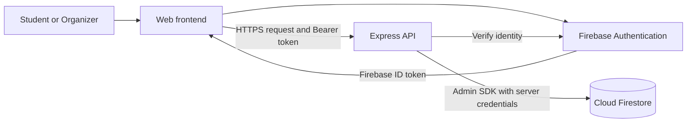
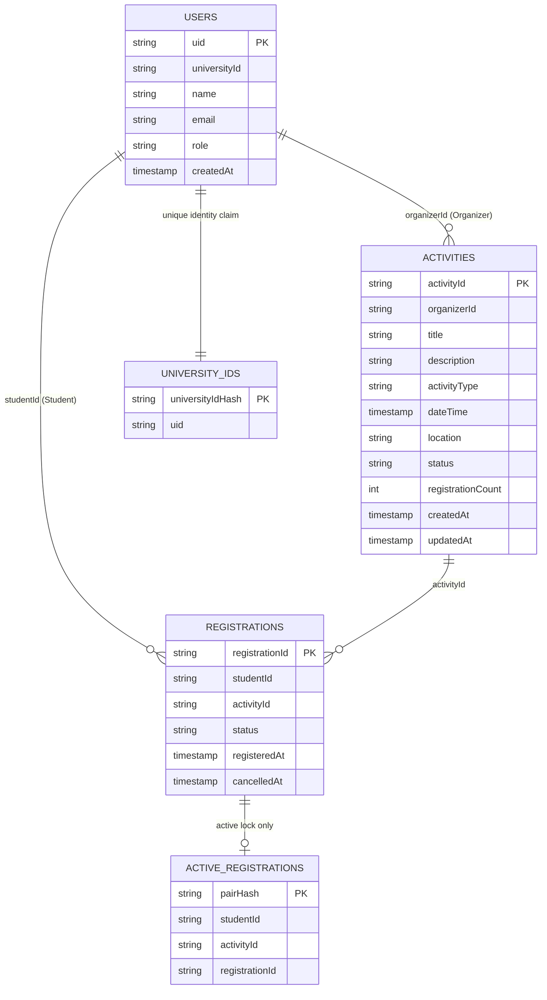

# Assignment 3 Database Design — Campus Events & Clubs


**Selected database:** Firebase Cloud Firestore, Standard edition  
**Authentication:** Firebase Authentication  
**Backend:** Node.js + Express + Firebase Admin SDK  


## 1. Design the database for the Mini Project

### Architecture




## 2. Explain why Firebase Firestore was chosen

We selected Firestore because the project has a small, document-oriented data model and needs managed identity, straightforward CRUD operations, and atomic registration updates. Firebase Authentication and the Admin SDK provide a consistent authentication/backend integration without building password management.


## 3. Create the schema and migrate/deploy to the remote database

### Supplied implementation files

| File | Purpose |
|---|---|
| [firebase.json](../firebase/firebase.json) | Firestore deployment configuration |
| [firestore.rules](../firebase/firestore.rules) | Deny direct client database access |
| [firestore.indexes.json](../firebase/firestore.indexes.json) | Composite indexes for API queries |
| [seed.mjs](../firebase/seed.mjs) | Provision two existing Auth users and create a demo activity |
| [api.mjs](../firebase/api.mjs) | Authenticated Express CRUD implementation |
| [package.json](../firebase/package.json) | Dependencies and run commands |


## 4. Show the collection/document structure and database schema

The collection tree and field tables in section 1 are the Firestore schema representation requested by the assignment. The following diagram also shows the logical relationships; it does not imply that Firestore enforces foreign keys.



An organizer manages many activities; a student has many registrations; an activity has many registrations. Registrations resolve the student/activity many-to-many relationship. Only active registrations have a uniqueness lock.

## 5. Provide APIs with at least CRUD operations

**Local demonstration base URL:** `http://127.0.0.1:3000`  
**Authentication header:** `Authorization: Bearer <Firebase ID token>`  
**JSON header for writes:** `Content-Type: application/json`

| Operation | Method and endpoint | Permission / behavior |
|---|---|---|
| Health | `GET /health` | Public; confirms the API process is running, not database connectivity |
| Read profile | `GET /api/me` | Authenticated, provisioned user; own profile |
| **Create** activity | `POST /api/activities` | Organizer; creates a complete `DRAFT` |
| **Read** activities | `GET /api/activities?limit=20&after=<id>` | Authenticated user; only published activities |
| **Read** activity | `GET /api/activities/:id` | Published activity or own organizer activity |
| **Update** activity | `PATCH /api/activities/:id` | Owning Organizer; fields and/or publication status |
| **Delete** activity | `DELETE /api/activities/:id` | Owning Organizer; unused drafts only; actual physical deletion |
| Create registration | `POST /api/activities/:id/registrations` | Student; transactional registration for self |
| Read own registrations | `GET /api/me/registrations` | Own active registrations, newest first |
| Read activity registrations | `GET /api/activities/:id/registrations` | Owning Organizer; includes active and cancelled history |
| Update registration | `PATCH /api/registrations/:id` | Owning Student; only `{"status":"CANCELLED"}` accepted |


| HTTP status | Meaning / example error code |
|---|---|
| `200` | Read or update successful |
| `201` | Resource created |
| `204` | Draft deleted; no response body |
| `400` | Invalid fields, status, date/time, limit, or cursor |
| `401` | Missing, expired, invalid, or revoked ID token |
| `403` | Unverified email, unprovisioned account, wrong role, or ownership failure |
| `404` | Resource missing or activity not visible to the requester |
| `409` | Duplicate registration, closed registration, invalid lifecycle operation, or integrity conflict |
| `500` | Unexpected backend failure; internal details are not returned |

## 6. Demonstrate APIs with example requests and responses

### Obtain tokens and prepare the demonstration

Sign in with each verified Firebase account in the frontend and obtain its ID token using Firebase Authentication's `currentUser.getIdToken()`. Set the two shell variables to those short-lived tokens. Firebase web configuration/API keys are not substitutes for an ID token.

```bash
export BASE_URL='http://127.0.0.1:3000'
export ORGANIZER_TOKEN='ACTUAL_ORGANIZER_FIREBASE_ID_TOKEN'
export STUDENT_TOKEN='ACTUAL_STUDENT_FIREBASE_ID_TOKEN'
```

The resource IDs, UIDs, and timestamps in the example responses are placeholders; use the IDs returned by your running API.

### A. Create an activity — Create

```bash
curl -i -X POST "$BASE_URL/api/activities" \
  -H "Authorization: Bearer $ORGANIZER_TOKEN" \
  -H 'Content-Type: application/json' \
  -d '{"title":"Backend Workshop","description":"Learn API and database design.","activityType":"EVENT","dateTime":"2026-10-02T09:00:00+07:00","location":"Computer Lab 1"}'
```

Example: `201 Created`

```json
{
  "id": "ACTIVITY_ID_FROM_CREATE",
  "title": "Backend Workshop",
  "description": "Learn API and database design.",
  "activityType": "EVENT",
  "dateTime": "2026-10-02T02:00:00.000Z",
  "location": "Computer Lab 1",
  "organizerId": "ORGANIZER_AUTH_UID",
  "status": "DRAFT",
  "registrationCount": 0,
  "createdAt": "2026-09-16T10:10:00.000Z",
  "updatedAt": "2026-09-16T10:10:00.000Z"
}
```

```bash
export ACTIVITY_ID='ACTUAL_ID_RETURNED_BY_CREATE'
```

### B. Publish and change the location — Update

```bash
curl -i -X PATCH "$BASE_URL/api/activities/$ACTIVITY_ID" \
  -H "Authorization: Bearer $ORGANIZER_TOKEN" \
  -H 'Content-Type: application/json' \
  -d '{"status":"PUBLISHED","location":"Computer Lab 2"}'
```

Example: `200 OK`, with the full activity document as in A and these changed fields:

```json
{
  "status": "PUBLISHED",
  "location": "Computer Lab 2",
  "updatedAt": "2026-09-16T10:11:00.000Z"
}
```

### C. List published activities — Read

```bash
curl -i "$BASE_URL/api/activities?limit=20" \
  -H "Authorization: Bearer $STUDENT_TOKEN"
```

Example: `200 OK`. Each `data` item is a full activity document, as in A. The structural example below uses abbreviated activity objects:

```json
{
  "data": [
    {"id":"demo-welcome-event","title":"Campus Welcome Event","status":"PUBLISHED"},
    {"id":"ACTIVITY_ID_FROM_CREATE","title":"Backend Workshop","status":"PUBLISHED"}
  ],
  "nextCursor": null
}
```

If `nextCursor` is present, request the next page with `?limit=20&after=<nextCursor>`.

### D. Read one activity and the current user

```bash
curl -i "$BASE_URL/api/activities/$ACTIVITY_ID" \
  -H "Authorization: Bearer $STUDENT_TOKEN"
curl -i "$BASE_URL/api/me" \
  -H "Authorization: Bearer $STUDENT_TOKEN"
```

The first request returns `200 OK` and the full published activity document. The second returns `200 OK`:

```json
{
  "id": "STUDENT_AUTH_UID",
  "universityId": "DEMO-STUDENT-001",
  "name": "Demo Student",
  "email": "student@example.edu",
  "role": "STUDENT",
  "createdAt": "2026-09-16T10:00:00.000Z"
}
```

### E. Register for an activity

```bash
curl -i -X POST "$BASE_URL/api/activities/$ACTIVITY_ID/registrations" \
  -H "Authorization: Bearer $STUDENT_TOKEN"
```

Example: `201 Created`

```json
{
  "id": "REGISTRATION_ID_FROM_CREATE",
  "studentId": "STUDENT_AUTH_UID",
  "activityId": "ACTIVITY_ID_FROM_CREATE",
  "status": "ACTIVE",
  "registeredAt": "2026-09-16T10:12:00.000Z",
  "cancelledAt": null
}
```

Repeating this request while the registration is active returns `409 Conflict`:

```json
{"error":{"code":"ALREADY_REGISTERED"}}
```

### F. Read student registrations and organizer participant records

```bash
curl -i "$BASE_URL/api/me/registrations" \
  -H "Authorization: Bearer $STUDENT_TOKEN"
curl -i "$BASE_URL/api/activities/$ACTIVITY_ID/registrations" \
  -H "Authorization: Bearer $ORGANIZER_TOKEN"
```

Example for either request before cancellation: `200 OK`

```json
{
  "data": [{
    "id": "REGISTRATION_ID_FROM_CREATE",
    "studentId": "STUDENT_AUTH_UID",
    "activityId": "ACTIVITY_ID_FROM_CREATE",
    "status": "ACTIVE",
    "registeredAt": "2026-09-16T10:12:00.000Z",
    "cancelledAt": null
  }]
}
```

Another organizer requesting the participant list receives `403 Forbidden` with `{"error":{"code":"FORBIDDEN"}}`.

### G. Cancel a registration

```bash
export REGISTRATION_ID='ACTUAL_ID_RETURNED_BY_REGISTRATION'
curl -i -X PATCH "$BASE_URL/api/registrations/$REGISTRATION_ID" \
  -H "Authorization: Bearer $STUDENT_TOKEN" \
  -H 'Content-Type: application/json' \
  -d '{"status":"CANCELLED"}'
```

Example: `200 OK`

```json
{
  "id": "REGISTRATION_ID_FROM_CREATE",
  "studentId": "STUDENT_AUTH_UID",
  "activityId": "ACTIVITY_ID_FROM_CREATE",
  "status": "CANCELLED",
  "registeredAt": "2026-09-16T10:12:00.000Z",
  "cancelledAt": "2026-09-16T10:15:00.000Z"
}
```


### H. Delete an unused draft — Delete

Create a second activity using A and leave it in `DRAFT`. Do not use the published activity from B:

```bash
export DRAFT_ID='ACTUAL_ID_OF_SECOND_UNUSED_DRAFT'
curl -i -X DELETE "$BASE_URL/api/activities/$DRAFT_ID" \
  -H "Authorization: Bearer $ORGANIZER_TOKEN"
```

Example: `204 No Content`, with an empty response body. A subsequent GET for that ID returns `404 Not Found` and `{"error":{"code":"NOT_FOUND"}}`.

Attempting to delete the published activity returns `409 Conflict` and `{"error":{"code":"ONLY_UNUSED_DRAFT_CAN_BE_DELETED"}}`. Close it instead:

```bash
curl -i -X PATCH "$BASE_URL/api/activities/$ACTIVITY_ID" \
  -H "Authorization: Bearer $ORGANIZER_TOKEN" \
  -H 'Content-Type: application/json' \
  -d '{"status":"CLOSED"}'
```

Example: `200 OK`, returning the activity with `status: "CLOSED"`. New registrations then return `409 Conflict` with `{"error":{"code":"REGISTRATION_CLOSED"}}`.

