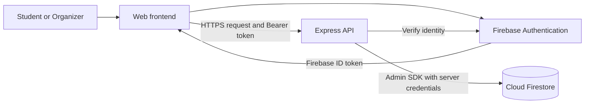
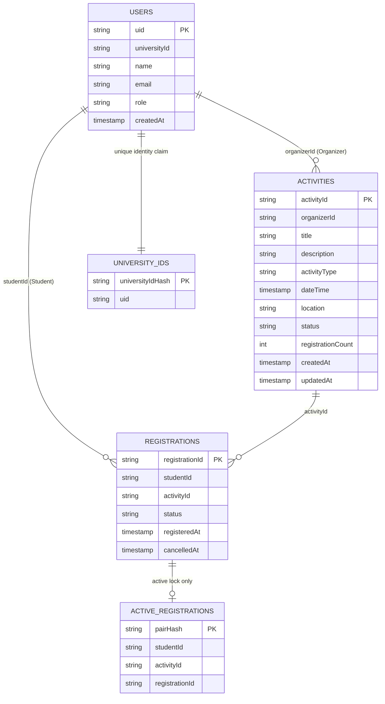

# Mini Project Database Assignment — Campus Events & Clubs

**Team:** 12  
**Perspective:** Senior Backend Developer  
**Selected database:** Firebase Cloud Firestore, Standard edition  
**Authentication:** Firebase Authentication  
**Backend:** Node.js + Express + Firebase Admin SDK  
**Date:** 16 September 2026

This submission answers the six instructions in the assignment. Its scope follows the existing [MVP requirements](group_assignment/02_requirement.md): organizers publish campus activities; students discover, register for, and cancel participation in those activities. A club activity is an activity type, rather than a separate membership system.

**Delivery status:** The database design, deployment configuration, seed script, CRUD backend, and example requests are supplied. Remote deployment and live API verification are pending a Firebase project ID and authorized credentials. Responses below are illustrative examples, not evidence of a completed deployment.

This assignment adopts the user's selected Firebase architecture. Earlier repository documents evaluate or select Supabase; this file is a separate Firebase implementation proposal and does not imply that those earlier submissions have been rewritten.

## 1. Design the database for the Mini Project

### Architecture



The frontend signs in with Firebase Authentication and sends its ID token to the API. The API verifies the token and reads the protected user role before accessing Firestore. Passwords are managed by Firebase Authentication and are never stored in Firestore. See [Firebase ID-token verification](https://firebase.google.com/docs/auth/admin/verify-id-tokens).

### Collection and document structure

Firestore stores documents in collections rather than SQL tables. A document ID identifies a record; fields describe its data. This design uses three business collections and two internal collections for uniqueness. See the [Firestore data model](https://firebase.google.com/docs/firestore/data-model).

```text
(default) Firestore database
├── users/
│   ├── {organizerFirebaseAuthUid}
│   └── {studentFirebaseAuthUid}
├── activities/
│   ├── {autoGeneratedActivityId}
│   └── demo-welcome-event
├── registrations/
│   └── {autoGeneratedRegistrationId}
├── activeRegistrations/                 # Internal uniqueness locks
│   └── {sha256(JSON.stringify([studentUid, activityId]))}
└── universityIds/                       # Internal identity uniqueness locks
    └── {sha256(universityId)}
```

Registrations are separate documents, avoiding a growing participant array inside each activity. The backend can query a student's registrations or an activity's registrations without loading unrelated users.

### Logical schema: `users/{uid}`

| Field | Firestore type | Rule / purpose |
|---|---|---|
| Document ID: `uid` | Document ID | Exactly the user's Firebase Authentication UID |
| `universityId` | String | Required, unique through `universityIds`, assigned through trusted provisioning |
| `name` | String | Required display name |
| `email` | String | Verified email obtained from Firebase Authentication |
| `role` | String | `STUDENT` or `ORGANIZER`; assigned by a trusted operator |
| `createdAt` | Timestamp | Server-generated creation time |

Example representation:

```json
{
  "universityId": "DEMO-STUDENT-001",
  "name": "Demo Student",
  "email": "student@example.edu",
  "role": "STUDENT",
  "createdAt": "2026-09-16T10:00:00.000Z"
}
```

### Logical schema: `activities/{activityId}`

| Field | Firestore type | Rule / purpose |
|---|---|---|
| Document ID: `activityId` | Document ID | Auto-generated by Firestore; seed uses a fixed demo ID |
| `title` | String | Required; 1–200 characters after validation |
| `description` | String | Required; maximum 5,000 characters |
| `activityType` | String | `EVENT` or `CLUB_ACTIVITY` |
| `dateTime` | Timestamp | Activity time; API accepts ISO 8601 with an explicit timezone |
| `location` | String | Required; maximum 200 characters |
| `organizerId` | String | Existing organizer UID; derived from the verified identity |
| `status` | String | `DRAFT`, `PUBLISHED`, or `CLOSED` |
| `registrationCount` | Integer | Nonnegative count of active registrations, changed transactionally |
| `createdAt` | Timestamp | Server-generated creation time |
| `updatedAt` | Timestamp | Server-generated last modification time |

Example representation:

```json
{
  "title": "Campus Welcome Event",
  "description": "Meet students and discover campus activities.",
  "activityType": "EVENT",
  "dateTime": "2026-10-01T03:00:00.000Z",
  "location": "University Main Hall",
  "organizerId": "ORGANIZER_AUTH_UID",
  "status": "PUBLISHED",
  "registrationCount": 0,
  "createdAt": "2026-09-16T10:00:00.000Z",
  "updatedAt": "2026-09-16T10:00:00.000Z"
}
```

### Logical schema: `registrations/{registrationId}`

| Field | Firestore type | Rule / purpose |
|---|---|---|
| Document ID: `registrationId` | Document ID | Auto-generated for each new registration attempt that succeeds |
| `studentId` | String | Existing Student UID, derived from the verified identity |
| `activityId` | String | Existing activity document ID |
| `status` | String | `ACTIVE` or `CANCELLED` |
| `registeredAt` | Timestamp | Server-generated registration time |
| `cancelledAt` | Timestamp or Null | Null while active; server timestamp when cancelled |

Example representation:

```json
{
  "studentId": "STUDENT_AUTH_UID",
  "activityId": "demo-welcome-event",
  "status": "ACTIVE",
  "registeredAt": "2026-09-16T10:05:00.000Z",
  "cancelledAt": null
}
```

In these JSON examples, timestamps are shown as ISO strings for readability. The supplied backend stores actual Firestore `Timestamp` values and serializes them to ISO strings in HTTP responses.

### Internal schemas

| Collection | Document ID | Fields | Purpose |
|---|---|---|---|
| `activeRegistrations` | SHA-256 of the JSON array `[studentUid, activityId]` | `studentId`, `activityId`, `registrationId` (Strings) | One lock per currently active student/activity pair |
| `universityIds` | SHA-256 of the canonical university ID | `uid` (String) | Reserve a university ID for exactly one Auth UID |

University IDs must be supplied in the university's canonical format. The demo script accepts 1–40 ASCII letters, numbers, or hyphens. These helper collections enforce constraints and do not introduce additional product entities.

### Integrity and transaction design

Firestore does not enforce SQL foreign keys or a PostgreSQL partial unique index. The application must validate references and implement uniqueness with document IDs and transactions.

**Register:** In one transaction, read the activity and the student's deterministic active-registration lock. Reject missing/non-published activities and existing locks. Create a new registration history document and the lock, then increment `registrationCount`. Concurrent requests for the same pair contend on the same lock, preventing two successful active registrations.

**Cancel:** In one transaction, verify registration ownership, read its activity and lock, mark the registration `CANCELLED`, set `cancelledAt`, delete its matching lock, and decrement the count. Repeated cancellation returns the already-cancelled record. A later registration creates a new history document and lock, preserving the cancelled record.

**Publish/update:** Verify organizer ownership inside a transaction. Required fields must be valid before publication. Published or closed activities cannot return to `DRAFT` in this implementation.

**Delete:** Allow physical deletion only for an organizer's unused draft. Activities that have been published are closed instead, preserving registration references. Registrations have no permanent-delete API.

**Provision users:** Obtain verified users from Firebase Authentication. Create the profile and university-ID claim in one transaction. Clients cannot assign roles or supply another student's UID to register.

All reads occur before writes in each transaction. Firestore may retry a transaction after contention, so transaction callbacks perform no email sending or other external side effects. See [Firestore transactions](https://firebase.google.com/docs/firestore/manage-data/transactions).

No capacity limits, registration deadlines, permanent club memberships, payments, or administrator product role are added to the MVP.

## 2. Explain why Firebase Firestore was chosen

I selected Firestore because the project has a small, document-oriented data model and needs managed identity, straightforward CRUD operations, and atomic registration updates. Firebase Authentication and the Admin SDK provide a consistent authentication/backend integration without building password management.

| Decision factor | Reason for this project |
|---|---|
| Development effort | Three business collections are easy for a five-student team to understand |
| Identity integration | Firebase Authentication supplies stable UIDs and verifiable ID tokens |
| Registration correctness | Transactions and deterministic lock documents protect active-registration uniqueness |
| Managed infrastructure | Firestore avoids provisioning and maintaining a database server |
| Query requirements | The MVP uses indexed activity and registration queries rather than complex reporting joins |
| Budget | A small classroom demo can target Spark's no-cost allowance if usage remains within limits |

The tradeoffs are additional application logic for uniqueness and references, read/write-based usage accounting, and less convenient relational reporting. Updating an activity's count for every registration also creates contention on popular activities; it is acceptable as an MVP design assumption and must be tested against demonstration traffic.

Firestore currently lists a no-cost allowance of 1 GiB stored data, 50,000 document reads/day, 20,000 writes/day, 20,000 deletes/day, and 10 GiB/month outbound transfer, with one free database per project. These are service allowances, not a promise that every Firebase product is free. See [Firestore usage limits](https://firebase.google.com/docs/firestore/quotas).

Use the Spark plan for this database demonstration and avoid Firebase Cloud Functions, whose deployment requires Blaze. The supplied Express API can run locally while accessing the remote Firestore database. Public API hosting is a separate deployment decision; it has not been performed here. See [Firebase pricing plans](https://firebase.google.com/docs/projects/billing/firebase-pricing-plans).

## 3. Create the schema and migrate/deploy to the remote database

### Supplied implementation files

| File | Purpose |
|---|---|
| [firebase.json](../firebase/firebase.json) | Firestore deployment configuration |
| [firestore.rules](../firebase/firestore.rules) | Deny direct client database access |
| [firestore.indexes.json](../firebase/firestore.indexes.json) | Composite indexes for API queries |
| [seed.mjs](../firebase/seed.mjs) | Provision two existing Auth users and create a demo activity |
| [api.mjs](../firebase/api.mjs) | Authenticated Express CRUD implementation |
| [package.json](../firebase/package.json) | Dependencies and run commands |

Firestore is schemaless: there is no SQL `CREATE TABLE` migration. The logical schema is implemented by backend validation, controlled provisioning, indexes, and document writes. Deploying rules/indexes alone does not create user or activity documents. The seed script creates those records remotely.

### A. Create and configure the Firebase project

1. Open the [Firebase Console](https://console.firebase.google.com/) and create or select the assignment project.
2. Record its **project ID**, which differs from its display name.
3. Create a Cloud Firestore **Standard edition** database with database ID `(default)`. Select an appropriate region near campus users, and start with restrictive rules.
4. In Authentication, enable Email/Password sign-in. Create two demo accounts using email addresses you control and complete email verification. Record their Auth UIDs. Do not use the example email addresses literally.
5. Assign one account to the Organizer and the other to the Student through the trusted seed script below. This is an operator setup task, not a new Administrator application role.

### B. Install and authenticate deployment tools

Run from the repository root using Node.js 22 or newer:

```bash
cd firebase
npm install
npm install --global firebase-tools
firebase login
export FIREBASE_PROJECT_ID='YOUR_FIREBASE_PROJECT_ID'
firebase deploy --project "$FIREBASE_PROJECT_ID" --only firestore:rules,firestore:indexes
```

The Firebase CLI login authorizes deployment; it does not automatically provide Admin SDK credentials to the Node process. See the [Firebase CLI reference](https://firebase.google.com/docs/cli).

The database rules are intentionally:

```text
rules_version = '2';
service cloud.firestore {
  match /databases/{database}/documents {
    match /{document=**} {
      allow read, write: if false;
    }
  }
}
```

This architecture routes all application reads and writes through the API. Firebase server libraries bypass Firestore Security Rules and use IAM credentials, so token verification, role checks, input validation, and ownership checks in the API are mandatory. See [Security Rules and server access](https://firebase.google.com/docs/firestore/security/rules-conditions).

### C. Configure backend credentials and create remote documents

For this local demonstration, use a dedicated service account authorized for the selected project, with only the required Firestore and Firebase Authentication access. Store its JSON key outside this repository. Firebase documents the `GOOGLE_APPLICATION_CREDENTIALS` setup in [Admin SDK setup](https://firebase.google.com/docs/admin/setup).

```bash
# Continue inside firebase/. Replace every placeholder before running.
export GOOGLE_APPLICATION_CREDENTIALS='/absolute/private/path/service-account.json'
export ORGANIZER_UID='EXISTING_ORGANIZER_AUTH_UID'
export STUDENT_UID='EXISTING_STUDENT_AUTH_UID'
export ORGANIZER_UNIVERSITY_ID='DEMO-ORGANIZER-001'
export STUDENT_UNIVERSITY_ID='DEMO-STUDENT-001'
npm run seed
npm start
```

The seed script retrieves both Auth users, requires verified emails, assigns their protected roles, reserves university IDs, and creates `activities/demo-welcome-event`. It preserves matching existing profiles and the existing demo activity; it refuses to overwrite conflicting profiles. It seeds demo records rather than migrating an existing SQL database: no populated source database is supplied in this repository.

Wait until the composite indexes show **Enabled** in the console before running their queries. The supplied indexes support:

| Collection | Fields | API query |
|---|---|---|
| `activities` | `status ASC`, `dateTime ASC` | Published activities ordered by activity time; document ID breaks ties |
| `registrations` | `studentId ASC`, `status ASC`, `registeredAt DESC` | Student's active registrations, newest first |

The organizer's registration query filters by `activityId` and uses its automatic single-field index. See [Firestore index management](https://firebase.google.com/docs/firestore/query-data/indexing).

### D. Remote deployment evidence to attach

| Evidence | Status in this deliverable |
|---|---|
| Actual Firebase project ID and database region | Pending project selection |
| Successful rules/index deployment output | Pending authorized deployment |
| Console screenshot showing seeded documents | Pending seed execution |
| Indexes shown as Enabled | Pending deployment/index build |
| Live CRUD requests and responses | Pending authenticated execution |

Do not claim instruction 3 is completed remotely until these steps have succeeded. The current Firebase CLI account check failed locally; no successful authenticated project connection or remote write has been established during preparation.

## 4. Show the collection/document structure and database schema

The collection tree and field tables in section 1 are the Firestore schema representation requested by the assignment. The following diagram also shows the logical relationships; it does not imply that Firestore enforces foreign keys.



An organizer manages many activities; a student has many registrations; an activity has many registrations. Registrations resolve the student/activity many-to-many relationship. Only active registrations have a uniqueness lock.

## 5. Provide APIs with at least CRUD operations

**Local demonstration base URL:** `http://127.0.0.1:3000`  
**Authentication header:** `Authorization: Bearer <Firebase ID token>`  
**JSON header for writes:** `Content-Type: application/json`

| Operation | Method and endpoint | Permission / behavior |
|---|---|---|
| Health | `GET /health` | Public; confirms the API process is running, not database connectivity |
| Read profile | `GET /api/me` | Authenticated, provisioned user; own profile |
| **Create** activity | `POST /api/activities` | Organizer; creates a complete `DRAFT` |
| **Read** activities | `GET /api/activities?limit=20&after=<id>` | Authenticated user; only published activities |
| **Read** activity | `GET /api/activities/:id` | Published activity or own organizer activity |
| **Update** activity | `PATCH /api/activities/:id` | Owning Organizer; fields and/or publication status |
| **Delete** activity | `DELETE /api/activities/:id` | Owning Organizer; unused drafts only; actual physical deletion |
| Create registration | `POST /api/activities/:id/registrations` | Student; transactional registration for self |
| Read own registrations | `GET /api/me/registrations` | Own active registrations, newest first |
| Read activity registrations | `GET /api/activities/:id/registrations` | Owning Organizer; includes active and cancelled history |
| Update registration | `PATCH /api/registrations/:id` | Owning Student; only `{"status":"CANCELLED"}` accepted |

The activity resource implements all four CRUD operations. Registration cancellation is an update because the project requires retained history. The frontend may display a Closed activity from its saved registration information; the general activity-detail endpoint intentionally hides non-published activities from students.

Activity creation requires all descriptive fields even for a draft, simplifying this assignment implementation. The activity list supports cursor pagination and a limit of 1–50. Registration-list endpoints return at most 50 records for the classroom demonstration; full pagination must be added before claiming support for larger registration histories.

The backend rejects client-supplied `organizerId`, roles, timestamps, registration counts, and unknown activity fields. A student's identity is always taken from the token rather than a request body. Private participant lists do not include email addresses or university IDs.

| HTTP status | Meaning / example error code |
|---|---|
| `200` | Read or update successful |
| `201` | Resource created |
| `204` | Draft deleted; no response body |
| `400` | Invalid fields, status, date/time, limit, or cursor |
| `401` | Missing, expired, invalid, or revoked ID token |
| `403` | Unverified email, unprovisioned account, wrong role, or ownership failure |
| `404` | Resource missing or activity not visible to the requester |
| `409` | Duplicate registration, closed registration, invalid lifecycle operation, or integrity conflict |
| `500` | Unexpected backend failure; internal details are not returned |

## 6. Demonstrate APIs with example requests and responses

### Obtain tokens and prepare the demonstration

Sign in with each verified Firebase account in the frontend and obtain its ID token using Firebase Authentication's `currentUser.getIdToken()`. Set the two shell variables to those short-lived tokens. Firebase web configuration/API keys are not substitutes for an ID token.

```bash
export BASE_URL='http://127.0.0.1:3000'
export ORGANIZER_TOKEN='ACTUAL_ORGANIZER_FIREBASE_ID_TOKEN'
export STUDENT_TOKEN='ACTUAL_STUDENT_FIREBASE_ID_TOKEN'
```

The resource IDs, UIDs, and timestamps in the example responses are placeholders; use the IDs returned by your running API.

### A. Create an activity — Create

```bash
curl -i -X POST "$BASE_URL/api/activities" \
  -H "Authorization: Bearer $ORGANIZER_TOKEN" \
  -H 'Content-Type: application/json' \
  -d '{"title":"Backend Workshop","description":"Learn API and database design.","activityType":"EVENT","dateTime":"2026-10-02T09:00:00+07:00","location":"Computer Lab 1"}'
```

Example: `201 Created`

```json
{
  "id": "ACTIVITY_ID_FROM_CREATE",
  "title": "Backend Workshop",
  "description": "Learn API and database design.",
  "activityType": "EVENT",
  "dateTime": "2026-10-02T02:00:00.000Z",
  "location": "Computer Lab 1",
  "organizerId": "ORGANIZER_AUTH_UID",
  "status": "DRAFT",
  "registrationCount": 0,
  "createdAt": "2026-09-16T10:10:00.000Z",
  "updatedAt": "2026-09-16T10:10:00.000Z"
}
```

```bash
export ACTIVITY_ID='ACTUAL_ID_RETURNED_BY_CREATE'
```

### B. Publish and change the location — Update

```bash
curl -i -X PATCH "$BASE_URL/api/activities/$ACTIVITY_ID" \
  -H "Authorization: Bearer $ORGANIZER_TOKEN" \
  -H 'Content-Type: application/json' \
  -d '{"status":"PUBLISHED","location":"Computer Lab 2"}'
```

Example: `200 OK`, with the full activity document as in A and these changed fields:

```json
{
  "status": "PUBLISHED",
  "location": "Computer Lab 2",
  "updatedAt": "2026-09-16T10:11:00.000Z"
}
```

### C. List published activities — Read

```bash
curl -i "$BASE_URL/api/activities?limit=20" \
  -H "Authorization: Bearer $STUDENT_TOKEN"
```

Example: `200 OK`. Each `data` item is a full activity document, as in A. The structural example below uses abbreviated activity objects:

```json
{
  "data": [
    {"id":"demo-welcome-event","title":"Campus Welcome Event","status":"PUBLISHED"},
    {"id":"ACTIVITY_ID_FROM_CREATE","title":"Backend Workshop","status":"PUBLISHED"}
  ],
  "nextCursor": null
}
```

If `nextCursor` is present, request the next page with `?limit=20&after=<nextCursor>`.

### D. Read one activity and the current user

```bash
curl -i "$BASE_URL/api/activities/$ACTIVITY_ID" \
  -H "Authorization: Bearer $STUDENT_TOKEN"
curl -i "$BASE_URL/api/me" \
  -H "Authorization: Bearer $STUDENT_TOKEN"
```

The first request returns `200 OK` and the full published activity document. The second returns `200 OK`:

```json
{
  "id": "STUDENT_AUTH_UID",
  "universityId": "DEMO-STUDENT-001",
  "name": "Demo Student",
  "email": "student@example.edu",
  "role": "STUDENT",
  "createdAt": "2026-09-16T10:00:00.000Z"
}
```

### E. Register for an activity

```bash
curl -i -X POST "$BASE_URL/api/activities/$ACTIVITY_ID/registrations" \
  -H "Authorization: Bearer $STUDENT_TOKEN"
```

Example: `201 Created`

```json
{
  "id": "REGISTRATION_ID_FROM_CREATE",
  "studentId": "STUDENT_AUTH_UID",
  "activityId": "ACTIVITY_ID_FROM_CREATE",
  "status": "ACTIVE",
  "registeredAt": "2026-09-16T10:12:00.000Z",
  "cancelledAt": null
}
```

Repeating this request while the registration is active returns `409 Conflict`:

```json
{"error":{"code":"ALREADY_REGISTERED"}}
```

### F. Read student registrations and organizer participant records

```bash
curl -i "$BASE_URL/api/me/registrations" \
  -H "Authorization: Bearer $STUDENT_TOKEN"
curl -i "$BASE_URL/api/activities/$ACTIVITY_ID/registrations" \
  -H "Authorization: Bearer $ORGANIZER_TOKEN"
```

Example for either request before cancellation: `200 OK`

```json
{
  "data": [{
    "id": "REGISTRATION_ID_FROM_CREATE",
    "studentId": "STUDENT_AUTH_UID",
    "activityId": "ACTIVITY_ID_FROM_CREATE",
    "status": "ACTIVE",
    "registeredAt": "2026-09-16T10:12:00.000Z",
    "cancelledAt": null
  }]
}
```

Another organizer requesting the participant list receives `403 Forbidden` with `{"error":{"code":"FORBIDDEN"}}`.

### G. Cancel a registration

```bash
export REGISTRATION_ID='ACTUAL_ID_RETURNED_BY_REGISTRATION'
curl -i -X PATCH "$BASE_URL/api/registrations/$REGISTRATION_ID" \
  -H "Authorization: Bearer $STUDENT_TOKEN" \
  -H 'Content-Type: application/json' \
  -d '{"status":"CANCELLED"}'
```

Example: `200 OK`

```json
{
  "id": "REGISTRATION_ID_FROM_CREATE",
  "studentId": "STUDENT_AUTH_UID",
  "activityId": "ACTIVITY_ID_FROM_CREATE",
  "status": "CANCELLED",
  "registeredAt": "2026-09-16T10:12:00.000Z",
  "cancelledAt": "2026-09-16T10:15:00.000Z"
}
```

The cancelled record disappears from the student's active-registration list but remains in the organizer's history. Repeating E succeeds with a new registration ID while retaining the cancelled record.

### H. Delete an unused draft — Delete

Create a second activity using A and leave it in `DRAFT`. Do not use the published activity from B:

```bash
export DRAFT_ID='ACTUAL_ID_OF_SECOND_UNUSED_DRAFT'
curl -i -X DELETE "$BASE_URL/api/activities/$DRAFT_ID" \
  -H "Authorization: Bearer $ORGANIZER_TOKEN"
```

Example: `204 No Content`, with an empty response body. A subsequent GET for that ID returns `404 Not Found` and `{"error":{"code":"NOT_FOUND"}}`.

Attempting to delete the published activity returns `409 Conflict` and `{"error":{"code":"ONLY_UNUSED_DRAFT_CAN_BE_DELETED"}}`. Close it instead:

```bash
curl -i -X PATCH "$BASE_URL/api/activities/$ACTIVITY_ID" \
  -H "Authorization: Bearer $ORGANIZER_TOKEN" \
  -H 'Content-Type: application/json' \
  -d '{"status":"CLOSED"}'
```

Example: `200 OK`, returning the activity with `status: "CLOSED"`. New registrations then return `409 Conflict` with `{"error":{"code":"REGISTRATION_CLOSED"}}`.

### Validation before final submission

These are required live checks; they have not been claimed as passed:

| Scenario | Expected result |
|---|---|
| Valid Organizer creates, reads, updates, deletes own unused draft | `201`, `200`, `200`, `204`; document gone after deletion |
| Student tries to create/update/delete an activity | `403`; no database mutation |
| Another Organizer updates or lists participants for an owned activity | `403` |
| Missing or invalid token | `401` |
| Direct Firestore client read/write | Denied by Security Rules |
| Two concurrent registrations for the same pair | Exactly one `201`, one `409`, one active registration and one lock |
| Cancellation followed by re-registration | Cancelled history preserved; one new active record and matching lock |
| Repeat cancellation after re-registration | Old cancelled record returned; newer lock/count untouched |
| Registration races with activity closing | Consistent transaction outcome; no successful registration against an already-committed closed state |
| Client attempts to change role/organizer/count through API | No public role-edit API; activity fields rejected |
| Duplicate university ID with another Auth UID | Provisioning refused |
| Student supplies timezone-free date/time or unknown activity field | `400` |

The supplied API is a local assignment implementation. Live quota usage, latency targets, transaction contention, and remote IAM access need verification in the selected Firebase project. Public hosting would also require configuring its server runtime, HTTPS, appropriate browser-origin access, and request-abuse controls.
